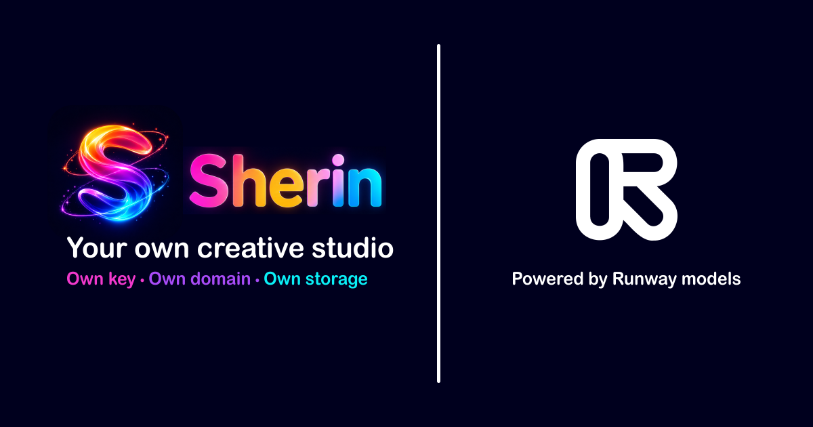
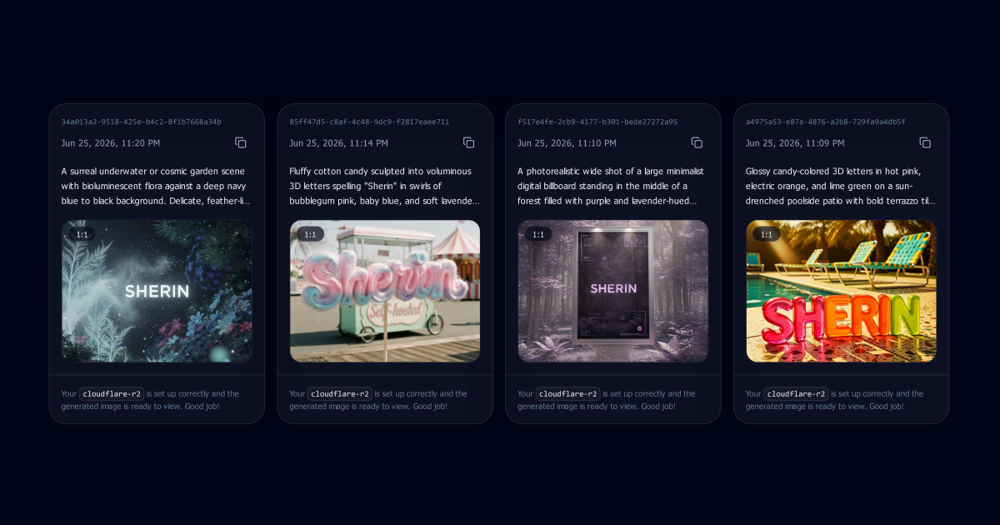

<div align="center">


# Sherin for Runway

Private workspace for generative media with own key, domain, and storage.

### Own key. Own domain. Own storage.

<br />

[](https://sherin-for-runway.babysea.live)

<br />

<strong>Project details</strong>

[](#babysea-oss-taxonomy)
[](#status)
[](LICENSE)

<br/>

<strong>Checks</strong>

[](https://app.netlify.com/projects/sherin-for-runway/deploys)
[](https://gitlab.com/babysea/sherin-for-runway/-/commits/main)
[](https://github.com/babysea-community/sherin-for-runway/actions/workflows/sentry-check.yml)
[](https://github.com/babysea-community/sherin-for-runway/actions/workflows/codeql.yml)
[](https://github.com/babysea-community/sherin-for-runway/actions/workflows/package-check.yml)

<br/>

<strong>Built with</strong>

[](https://nextjs.org)
[](https://react.dev)
[](https://github.com/babysea-community/semantic-lady)
[](https://babysea.ai)
[](https://runwayml.com)
[](https://supabase.com)
[](https://docs.aws.amazon.com/s3)
[](https://www.cloudflare.com)
[](https://vercel.com/docs/vercel-blob)
[](https://sentry.io)

<br/>

<strong>One-click deploy</strong>

[](https://cloud.digitalocean.com/apps/new?repo=https://github.com/babysea-community/sherin-for-runway/tree/main)
[](https://app.netlify.com/start/deploy?repository=https://github.com/babysea-community/sherin-for-runway)  
[](https://railway.com/deploy/sherin-for-runway?referralCode=_FJpRb)
[](https://render.com/deploy?repo=https://github.com/babysea-community/sherin-for-runway)  
[](https://vercel.com/new/clone?repository-url=https%3A%2F%2Fgithub.com%2Fbabysea-community%2Fsherin-for-runway&project-name=sherin-for-runway&repository-name=sherin-for-runway&env=NEXT_PUBLIC_SITE_URL,OWNER_EMAIL,NEXT_PUBLIC_SUPABASE_URL,NEXT_PUBLIC_SUPABASE_PUBLIC_KEY,SUPABASE_SECRET_KEY,INFERENCE_PROVIDER,RUNWAYML_API_SECRET,STORAGE_PROVIDER,CUSTOM_USER_STORAGE_QUOTA_GB)

<br />



<br />



</div>

<br />

## BabySea OSS taxonomy

BabySea open source projects are organized into three categories:

[](#babysea-oss-taxonomy)
[](#babysea-oss-taxonomy)
[](#babysea-oss-taxonomy)

| Category      | Description                                                                                                                                       |
| :------------ | :------------------------------------------------------------------------------------------------------------------------------------------------ |
| **SDK**       | Typed developer entry points for creating, tracking, and managing BabySea workloads from application code.                                        |
| **Primitive** | Reusable infrastructure boundaries extracted from BabySea's execution control plane. Each primitive focuses on one system concern.                |
| **Starter**   | Deployable reference applications that combine product UI, auth, storage, and BabySea execution patterns. Some starters may also include billing. |

## Status

BabySea OSS projects are published into three status levels:

[](#status)
[](#status)
[](#status)

| Status         | Description                                                                                                                                                                          |
| :------------- | :----------------------------------------------------------------------------------------------------------------------------------------------------------------------------------- |
| **Working**    | Fully implemented and deployable. All documented capabilities function as described. Suitable for personal and small-team use. No breaking-change guarantees between versions.       |
| **Production** | Working plus a hardened public runtime contract. Validated against a stated infrastructure stack with deterministic behavior, explicit failure modes, and a documented upgrade path. |
| **Alpha**      | Early-stage implementation. Core structure exists but some capabilities may be incomplete, undocumented, or subject to breaking changes. Not recommended for production deployments. |

See [`CHANGELOG.md`](CHANGELOG.md) to track releases and public contract changes.

---

## Quickstart

Run locally:

```bash
git clone https://github.com/babysea-community/sherin-for-runway.git
cd sherin-for-runway
pnpm install --frozen-lockfile
cp .env.example .env.local
```

Fill `.env.local` from [`.env.example`](.env.example), apply [`001_sherin.sql`](supabase/migrations/001_sherin.sql), then start the app:

For local sign-in, add `http://localhost:3011/auth/callback` to Supabase Auth Redirect URLs.

```bash
pnpm run doctor
pnpm dev
```

Open <http://localhost:3011>.

## Inference

Use [`.env.example`](.env.example) as the source of truth for inference mode and provider credentials.

This project can run direct Runway inference with `INFERENCE_PROVIDER=runway`, or call BabySea with `INFERENCE_PROVIDER=babysea` while keeping the same Studio workflow.

BabySea model schemas are published at [babysea.ai/model-schema](https://babysea.ai/model-schema).

## Storage

Use [`.env.example`](.env.example) as the source of truth for storage provider, quota, worker, and monitoring configuration.

Supabase Storage is the default and fallback storage path. AWS S3, Cloudflare R2, and Vercel Blob are available when you want generated media in your own bucket or blob store.

## Supported models

Supported model names and provider fields are registered in [`lib/model-family.ts`](lib/model-family.ts), [`lib/inference/runway/models.ts`](lib/inference/runway/models.ts), and [`lib/inference/babysea/models.ts`](lib/inference/babysea/models.ts).

| Model name               | Model ID                   |
| :----------------------- | :------------------------- |
| Runway Act Two           | `runway/act-two`           |
| Runway Aleph 2           | `runway/aleph-2`           |
| Runway Gen-4.5           | `runway/gen-4.5`           |
| Runway Gen-4 Aleph       | `runway/gen-4-aleph`       |
| Runway Gen-4 Image       | `runway/gen-4-image`       |
| Runway Gen-4 Image Turbo | `runway/gen-4-image-turbo` |
| Runway Gen-4 Turbo       | `runway/gen-4-turbo`       |

## Workspace

| Surface    | Purpose                                                                             |
| :--------- | :---------------------------------------------------------------------------------- |
| Studio     | Prompt, select a model, tune generation fields, upload references, and start jobs.  |
| Gallery    | Review completed, failed, unavailable, and in-flight generation records.            |
| References | Store uploaded and URL-based input images that can be reused in later generations.  |
| Usage      | Inspect provider, storage, queue, and quota state for the private workspace.        |
| Profile    | Review owner and deployment settings visible to the signed-in workspace owner only. |

## Runtime

- Sherin is owner-only. Supabase Google OAuth signs users in, and the configured owner allowlist gates dashboard access.
- Provider credentials, storage credentials, Supabase service role keys, Sentry auth tokens, and cron secrets stay server-side.
- Generation records, prompts, statuses, provider metadata, storage URLs, reference images, and profile state persist in Supabase Postgres.
- Studio, Gallery, References, and Usage can process queued/running generations. `/api/generations/process` can also be called by cron with the worker bearer secret configured from [`.env.example`](.env.example).
- Sherin is not a managed BabySea service, commercial support package, hosting service, billing starter, credit ledger, provider marketplace, or multi-tenant team workspace.

## Deployment

### DigitalOcean

[`.do/deploy.template.yaml`](.do/deploy.template.yaml) defines the DigitalOcean App Platform service, build command, start command, and environment prompts. Set `NEXT_PUBLIC_SITE_URL` to the DigitalOcean or custom domain, configure Supabase auth callback URLs, and prefer Supabase Storage, AWS S3, or Cloudflare R2 for generated media.

### Netlify

[`netlify.toml`](netlify.toml) builds with `pnpm build` and the Next.js plugin. Prefer Supabase Storage, AWS S3, or Cloudflare R2 on Netlify; if you intentionally use Vercel Blob outside Vercel, validate it with `STORAGE_SMOKE_TEST=1 pnpm run doctor`.

### Railway

Use the Deploy on Railway button above to start from the published Sherin template, or create a new Railway project from the public repository. Add every runtime variable from [`.env.example`](.env.example), and set `NEXT_PUBLIC_SITE_URL` to the Railway or custom domain. Prefer Supabase Storage, AWS S3, or Cloudflare R2 on Railway; if you intentionally use Vercel Blob outside Vercel, validate it with `STORAGE_SMOKE_TEST=1 pnpm run doctor`.

### Render

[`render.yaml`](render.yaml) builds with `pnpm build` and runs `pnpm start -- -p $PORT`. Prefer Supabase Storage, AWS S3, or Cloudflare R2 on Render; if you intentionally use Vercel Blob outside Vercel, validate it with `STORAGE_SMOKE_TEST=1 pnpm run doctor`.

### Vercel

Keep the checked-in [`vercel.json`](vercel.json) framework settings. Configure Supabase auth callback URLs with the final Vercel domain or custom domain, then redeploy after changing env values.

## Scheduler

Use an external scheduler for `GET /api/generations/process` when you want background recovery without opening the dashboard. Send the worker bearer secret configured from [`.env.example`](.env.example) and keep the frequency low enough to avoid `429` responses.

## Customize

| Change     | Files                                                                                                                                         |
| :--------- | :-------------------------------------------------------------------------------------------------------------------------------------------- |
| UI         | `app/page.tsx`, `app/access/page.tsx`, `app/dashboard/**`                                                                                     |
| Auth       | `lib/auth/owner.ts`, `app/access/_lib/server-actions.ts`, `supabase/migrations/001_sherin.sql`                                                |
| Models     | `lib/model-family.ts`, `lib/app-config.ts`, `lib/inference/runway/models.ts`, `lib/inference/babysea/models.ts`, `test/sherin-models.test.ts` |
| Inference  | `lib/inference/index.ts`, `lib/inference/runway/server-actions.ts`, `lib/inference/babysea/server-actions.ts`                                 |
| Storage    | `lib/storage/index.ts`, `lib/storage/*/server-actions.ts`, `lib/storage/s3-compatible-storage.ts`, `supabase/migrations/001_sherin.sql`       |
| Worker     | `app/dashboard/studio/_lib/generation-worker.ts`, `app/api/generations/process/route.ts`                                                      |
| Monitoring | `instrumentation.ts`, `instrumentation-client.ts`, `lib/monitoring`, `scripts/sentry-project-check.mjs`                                       |
| Deploy     | `.do/deploy.template.yaml`, `.env.example`, `netlify.toml`, `render.yaml`, `vercel.json`, `scripts/doctor.mjs`                                |

## Troubleshooting

| Symptom                             | Fix                                                                                                                 |
| :---------------------------------- | :------------------------------------------------------------------------------------------------------------------ |
| `doctor` fails                      | Read the missing env var or file printed by `doctor`; env names live in [`.env.example`](.env.example).             |
| Sign-in works but access is denied  | Check that the owner allowlist value from [`.env.example`](.env.example) exactly matches your Google account email. |
| Supabase redirects to the wrong URL | Align `NEXT_PUBLIC_SITE_URL`, Supabase Site URL, and Supabase Redirect URLs.                                        |
| Image generation does not start     | Verify the inference values configured from [`.env.example`](.env.example).                                         |
| Image shows as unavailable          | Generation succeeded but the stored file URL cannot be resolved; check `STORAGE_PROVIDER` and storage credentials.  |
| Jobs stay queued or running         | Open Studio, Gallery, References, or Usage to trigger processing, or configure cron for `/api/generations/process`. |
| Worker returns 401                  | Send the worker bearer secret configured from [`.env.example`](.env.example) and rotate it if it may have leaked.   |
| Worker returns 429                  | Reduce cron frequency or owner-triggered flushes; honor the `Retry-After` response header.                          |
| Sentry source maps are not uploaded | Confirm the Sentry build variables from [`.env.example`](.env.example) exist only in build/CI secrets.              |

## Security and compliance

The project publishes its trust signals through public GitHub, GitLab, or other CI provider checks so contributors can inspect the actual CI configuration, jobs, and reports.

## Community

Issues, pull requests, design discussion, and security reports should follow [`CONTRIBUTING.md`](CONTRIBUTING.md), [`CODE_OF_CONDUCT.md`](CODE_OF_CONDUCT.md), and [`SECURITY.md`](SECURITY.md).

## License

[Apache License 2.0](LICENSE).
